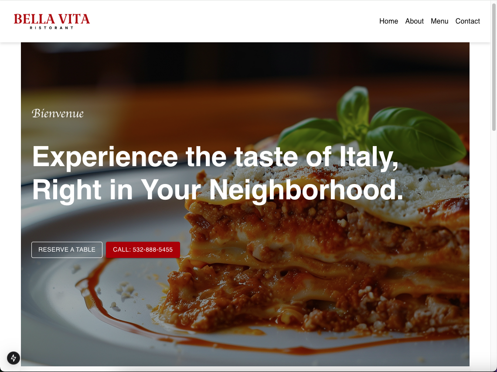
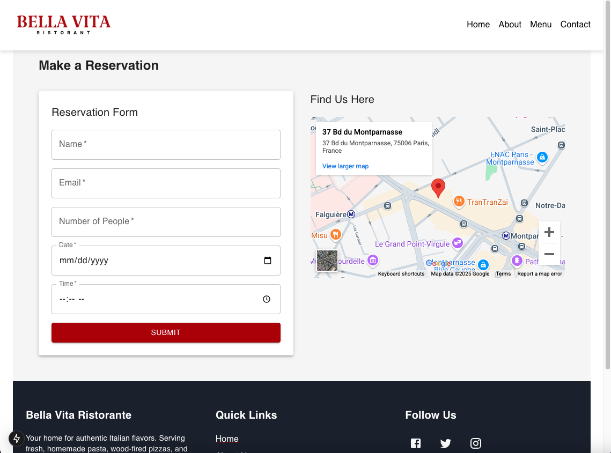
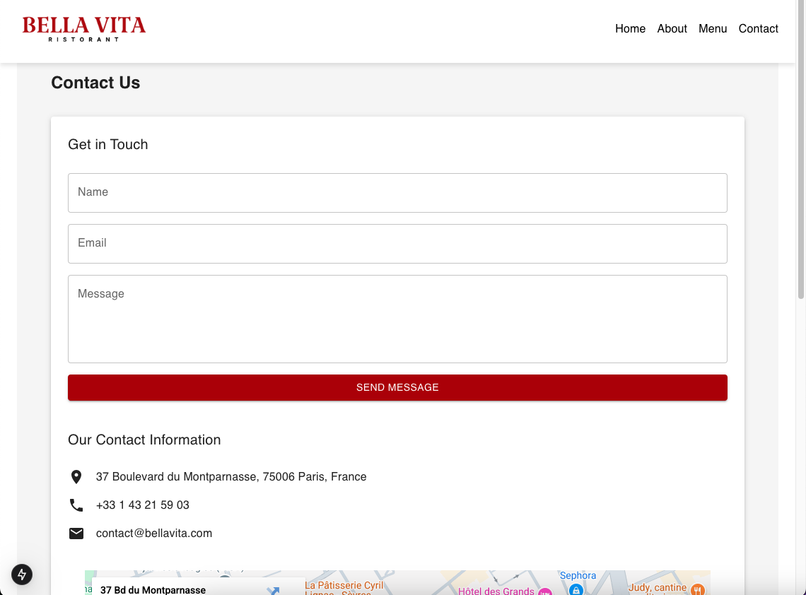
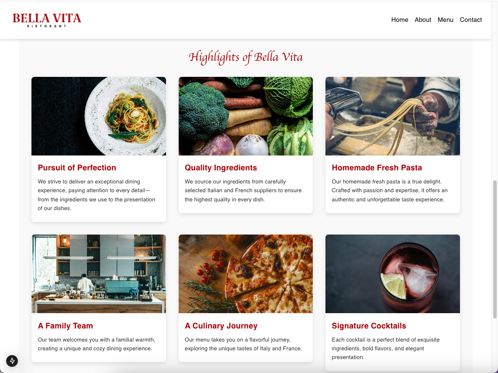

# Bella Vita Restaurant 🍝  
**A Next.js-based website for Bella Vita Restaurant, showcasing authentic Italian cuisine and a warm dining experience.**


## Table of Contents  
- [About the Project](#about-the-project)  
- [Features](#features)  
- [Tech Stack](#tech-stack)  
- [Installation](#installation)  
- [Usage](#usage)  
- [Screenshots](#screenshots)  
- [Contributing](#contributing)  
- [License](#license)  
- [Contact](#contact)  


## About the Project  
Bella Vita Restaurant is a fully responsive and dynamic website designed to highlight the charm of authentic Italian cuisine. It features an intuitive layout with dedicated sections for the restaurant's menu, story, contact information, and more.  
## Features  
- **Interactive Navigation:** Smooth scrolling and intuitive navigation.  
- **Dynamic Content:** Dedicated sections for the menu, about, and reservations.  
- **Material UI Integration:** Beautiful and consistent UI components.  
- **Responsive Design:** Optimized for both desktop and mobile devices.  
- **Contact Form:** Functional contact form with real-time validation.  
- **Map Integration:** Visual representation of the restaurant's location.

## Tech Stack  
- **Framework:** [Next.js](https://nextjs.org/)  
- **UI Library:** [Material UI](https://mui.com/)  
- **Styling:** CSS-in-JS with Material UI's theme customization.  
- **Icons:** Material UI Icons  
- **Deployment:** [Vercel](https://vercel.com/)  

## Installation  

1. Clone the repository:  
   ```bash
   git clone https://github.com/aafernands/bella-vita.git

   cd bella-vita
   ```

2. Install dependencies:
   ```bash
   npm install
   ```

3. Install `react-intersection-observer`:
   ```bash
   npm install react-intersection-observer
   ```

4. Start the development server:
   ```bash
   npm run dev
   ```

5. Open the app in your browser at 
   ```bash
   http://localhost:3000
   ```

---

## Usage  
- **Homepage:** Explore the story, menu, and services of Bella Vita Restaurant.  
- **Contact Page:** Send inquiries through the integrated contact form.  
- **Menu Section:** Browse curated Italian dishes and offerings.  
- **Reservation Section:** Placeholder for future integration with reservation systems.  

---

## Screenshots  

 - **Homepage:**




 - **Reservation Page:**




 - **Contact Page:**




 - **Highlights Section:**




---

## Contributing  
Contributions are welcome! Follow these steps to contribute:  

1. **Fork the repository.**  
2. **Create a new branch:**  
   ```bash  
   git checkout -b feature/your-feature-name  
   ```  
3. **Commit your changes:**  
   ```bash  
   git commit -m "Add your message here"  
   ```  
4. **Push to the branch:**  
   ```bash  
   git push origin feature/your-feature-name  
   ```  
5. **Open a pull request.**  


## License
This project is licensed under the MIT License. See the [LICENSE](./LICENSE) file for details.


 

## Contact  
- **Author:** Alex Fernandes  
- **Email:** alexfernands@outlook.com  
- **GitHub:** [aafernands](https://github.com/aafernands)  
- **Portfolio:** [aafernands.github.io](https://aafernands.github.io)  
